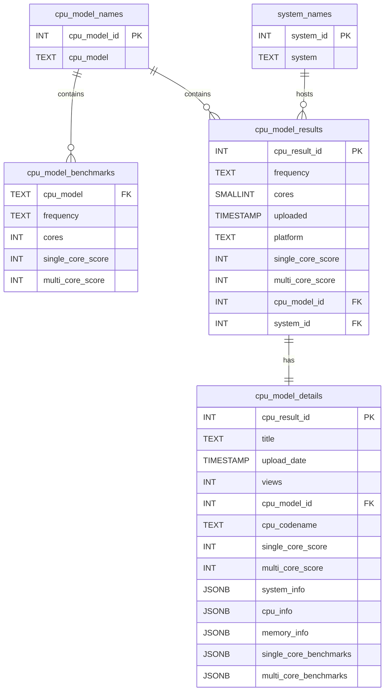

# Database schema

This document describes the tables created by the Geekbench scraping pipeline and how they relate to each other.

## Tables

### cpu_model_names
Stores the distinct CPU models that appear on Geekbench.
```sql
CREATE TABLE cpu_model_names (
    cpu_model_id INT GENERATED ALWAYS AS IDENTITY PRIMARY KEY,
    cpu_model TEXT
);
```

### system_names
Holds the names of computer systems discovered in result pages.
```sql
CREATE TABLE system_names (
    system_id INT GENERATED ALWAYS AS IDENTITY PRIMARY KEY,
    system TEXT
);
```

### cpu_model_benchmarks
Summary benchmark results for each CPU model taken from the benchmark page.
```sql
CREATE TABLE cpu_model_benchmarks (
    cpu_model TEXT,
    frequency TEXT,
    cores INT,
    single_core_score INT,
    multi_core_score INT
);
```
`cpu_model` refers to the text value stored in `cpu_model_names.cpu_model`.

### cpu_model_results
Individual benchmark results scraped from the results listing.
```sql
CREATE TABLE cpu_model_results (
    cpu_result_id INT,
    frequency TEXT,
    cores SMALLINT,
    uploaded TIMESTAMP,
    platform TEXT,
    single_core_score INT,
    multi_core_score INT,
    cpu_model_id INT REFERENCES cpu_model_names(cpu_model_id),
    system_id INT REFERENCES system_names(system_id)
);
```
Each row links a result to a CPU model and a system.

### cpu_model_details
Detailed information for a specific result.
```sql
CREATE TABLE cpu_model_details (
    cpu_result_id INT,
    title TEXT,
    upload_date TIMESTAMP,
    views INT,
    cpu_model_id INT REFERENCES cpu_model_names(cpu_model_id),
    cpu_codename TEXT,
    single_core_score INT,
    multi_core_score INT,
    system_info JSONB,
    cpu_info JSONB,
    memory_info JSONB,
    single_core_benchmarks JSONB,
    multi_core_benchmarks JSONB
);
```
`cpu_model_id` and `cpu_result_id` match entries in `cpu_model_results`.

## Relationships
- **cpu_model_names** is the dimension table for processors. Many other tables reference it via `cpu_model_id` or `cpu_model`.
- **system_names** contains unique system identifiers which are referenced by `cpu_model_results.system_id`.
- **cpu_model_benchmarks** records overall benchmark scores for each model; it links to `cpu_model_names` via the text `cpu_model`.
- **cpu_model_results** is the fact table with individual test runs, referencing both a CPU model and system.
- **cpu_model_details** stores extended metadata for selected results. Each detail row corresponds to one entry in `cpu_model_results`.

## ER diagram


